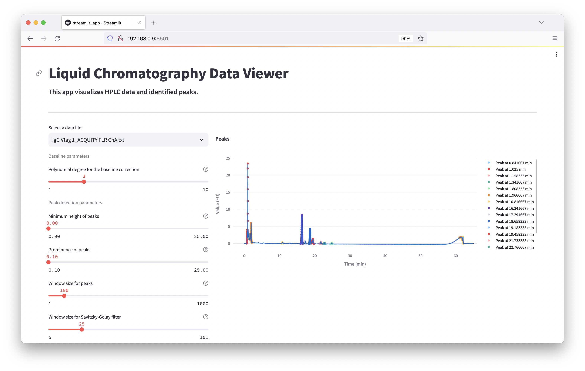

# Liquid Chromatography Data Viewer

## Overview
This application processes liquid chromatography data, specifically from the [ACQUITY UPLC FLR machine](https://www.waters.com/webassets/cms/support/docs/71500142403rb.pdf). It automates the parsing of metadata, detects peaks, interpolates the baseline, and calculates peak areas and elution volumes.



## Features
- **Peak Detection**: Automatically detects peaks in chromatography data.
- **Baseline Interpolation**: Interpolates the baseline for more accurate peak detection.
- **Area Calculation**: Calculates the area under the peak using Simpson's rule.
- **Elution Volume Calculation**: Computes the elution volume based on the flow rate and peak retention time.

## Usage 

### Prerequisites
- Place HPLC data files in `/data/`.

### Run locally as a Streamlit app
- Use `streamlit run streamlit_app.py`
- To run in Docker use `docker build -t lc_parser:latest .` and `docker run -p 8501:8501 lc_parser:latest`

### Use the package in Python script

```bash
pip install -r requirements.txt
```

```python
from pathlib import Path
from parser.chromatogram import Chromatogram

# Load chromatogram data
file_path = Path("./data/sample_data.txt")
chrom = Chromatogram(file_path)

# Process data
chrom.detect_peaks()
for peak in chrom.peaks:
    area = chrom.calculate_peak_area(peak)
    volume = chrom.calculate_elution_volume(peak, flow_rate=1.0)
    print(f"Peak at {peak.retention_time} min: Area = {area}, Volume = {volume}")

```
Output:
```
Peak at 2.34 min: Area = 150.5, Volume = 2.34
Peak at 5.22 min: Area = 300.1, Volume = 5.22
```
